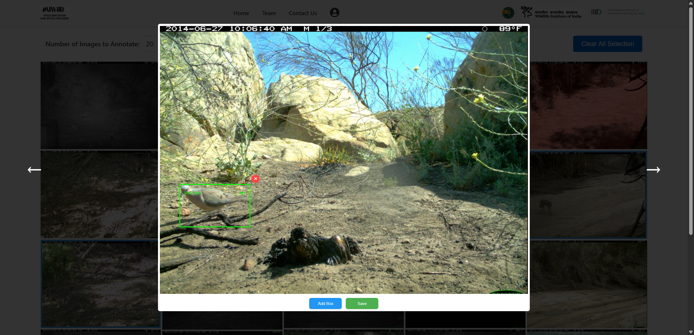

# Wildlife Project (Birdcount Specific Public Beta Repository)
A web application with a FastAPI backend and a React frontend designed for Human-in-the-Loop Visual Wildlife Monitoring Systems.

## Installation Options
Choose **one** of the following installation methods:
1. Local 
2. Docker

**Note**: Copy `.env.example` to `.env` and configure your environment variables (DB host/port/user/password, JWT secret, etc.) before running locally or via Docker.

## Local
### Clone the Repository
```bash
git clone https://github.com/Vision-IIITD/AIM-WC-Webapp.git
```

### Backend Setup
1. Navigate to the backend directory:
```bash
cd AIM-WC-Webapp/backend
```

2. Install required dependencies:  
```bash 
pip install -r requirements.txt
```

3. Download Required Model Files
   * Download [best.pt](https://drive.google.com/file/d/1jtUWahpwsVpe2QuLxC60z6pPBoZd7KgT/view) – YOLOv5 weights, and place in `backend/ObjectDetection/models/YOLO/runs/train/wii_28_072/weights/best.pt`
   * Download [bestx.pt](https://drive.google.com/file/d/1v6GjHgQtpGLUnchG0KUaTBUYGx4PQ1Rk/view) – YOLOv8 weights, and place in `backend/ObjectDetection/models/YOLO/runs/train/wii_28_072/weights/bestx.pt`
   * Download [original.pth](https://drive.google.com/file/d/1MiVNz53icmq-Miyn2ML3w0EELx1WDqHi/view) and place in `backend/BirdCount/model_files/pth/original.pth`

4. Setup Environment:
```bash
cp .env.example .env
```

5. Start Backend Server:
```bash
uvicorn main:app --reload
```

### Frontend Setup
1. Navigate to frontend directory:
```bash
cd AIM-WC-Webapp/frontend
```

2. Install dependencies:
```bash
npm install
```

3. Start frontend:
```bash
npm start
```

## Docker
### Docker Images 
* Backend: [awe35/backend](https://hub.docker.com/r/awe35/backend)
* Frontend: [awe35/frontend](https://hub.docker.com/r/awe35/frontend)

### Quick Start
1. Pull images:
```bash
docker pull awe35/backend:latest
docker pull awe35/frontend:latest
```

2. Run with docker compose:
```bash
docker-compose up -d
```

3. Access the Application:
* Frontend: http://localhost:3000
* Backend API: http://localhost:8000/docs

## Screenshots

### Home Page


### Login Page


### Sign Up Page


### Upload Consent


### Image Collage


### Filtering Options
#### By Box Count

#### By Species

#### Combined Filters


### Bounding Box Detection


### Annotating Image


### Active Learning Interface


### Admin Dashboard
#### Update Class

#### Bulk Update Classes

